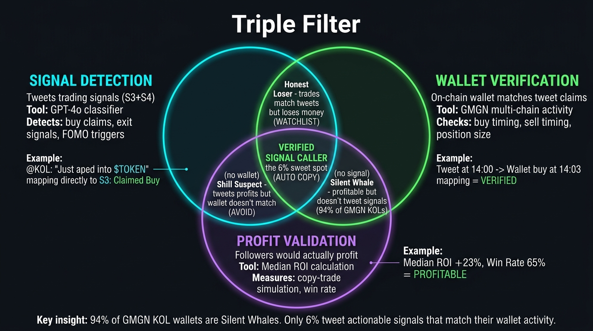
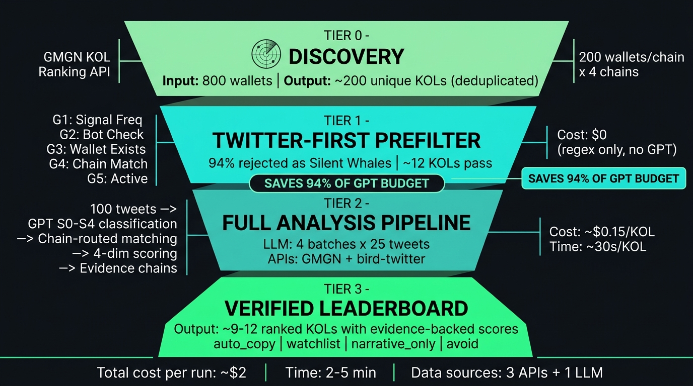
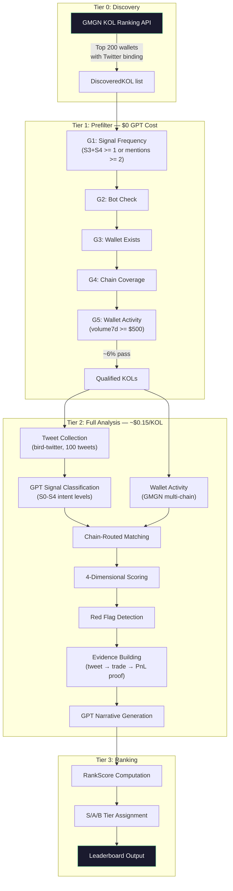

# Architecture Overview

**MemeRecall** is the Verified Signal Layer for Crypto Twitter. It discovers crypto KOLs, classifies their Twitter signals using GPT, verifies claims against on-chain wallet activity, and outputs a ranked leaderboard of **verified signal callers** -- KOLs who tweet what they trade, trade what they tweet, and make money doing it.

## The Triple Filter

Most crypto tools solve only one side of the problem:

| Filter | Question Answered | Without It |
|--------|-------------------|------------|
| **Signal Detection** | Does this person tweet trading signals? | Just a wallet tracker (Nansen) |
| **Wallet Verification** | Do they buy what they claim to buy? | Just sentiment analysis (LunarCrush) |
| **Profit Validation** | Would followers profit by copy-trading? | Just Twitter noise |

MemeRecall's value is in the **AND intersection** of all three. Only KOLs passing all three filters appear on the leaderboard.



## System Architecture





## Design Philosophy

### 1. Twitter-First: Reject 94% Before Spending on GPT

GMGN's KOL-tagged wallets are 94% Silent Whales -- profitable on-chain but they don't tweet trading signals. Running full GPT analysis on all of them would be wasteful. The 5-gate prefilter uses zero-cost regex and rule checks to reject non-signal KOLs before the pipeline spends $0.15/KOL on LLM classification.

### 2. The AND Is The Product

The natural instinct is to rank by wallet PnL (selects silent traders) or by tweet volume (selects shillers). MemeRecall's value proposition is the intersection: KOLs who **say it AND do it AND profit from it**. This intersection is naturally sparse (~30-50 globally), and that sparsity is a feature -- a 30-person verified whitelist beats a 500-person noise leaderboard.

### 3. Evidence Over Reputation

Every score has a proof chain. The Evidence Builder creates tweet-to-trade-to-PnL records that readers can verify independently. The Follower Simulator answers "what if I had copy-traded this KOL?" with concrete dollar amounts. This transforms subjective "trust" into auditable evidence.

### 4. Graceful Degradation

No single API failure kills the pipeline. If GMGN activity collection fails, the report ships without wallet verification (with appropriate red flags). If GPT classification times out, the batch is skipped. If evidence building fails, the report still includes scores and narrative. Each stage is independently fault-tolerant.

## Component Map

```
memerecall/                     # Turborepo monorepo
├── packages/core/              # Pipeline engine (all agents + types)
│   └── src/
│       ├── agents/             # 12 pipeline agents
│       ├── *-types.ts          # Shared type definitions
│       ├── gmgn-client.ts      # GMGN API client
│       └── llm-client.ts       # OpenAI-compatible LLM client
├── apps/api/                   # Elysia REST API (port 4049)
│   └── src/index.ts            # 20+ endpoints
├── apps/web/                   # Next.js dashboard
│   └── app/
│       ├── page.tsx            # Leaderboard (SSR)
│       ├── analysis/[handle]/  # KOL deep analysis card
│       └── watchroom/          # Token price watchroom
├── scripts/                    # CLI demo runners
├── data/                       # Runtime data (gitignored)
└── hermes/                     # Agent orchestration config
```

## Tech Stack

| Component | Technology | Why |
|-----------|-----------|-----|
| Runtime | Bun 1.3 + TypeScript | Native TS, fast startup, workspace support |
| Backend API | Elysia | Bun-native, minimal boilerplate |
| Frontend | Next.js 14 (App Router) | Server Components for SSR leaderboard |
| UI | shadcn/ui + Tailwind + ECharts | Terminal-aesthetic dashboard |
| LLM | OpenAI-compatible (GPT-4o) | Signal classification + narrative |
| Tweet Data | bird-twitter CLI | Free tier, no API costs |
| Wallet Data | GMGN OpenAPI + bb-browser | KOL-tagged wallets with chain coverage |
| Monorepo | Turborepo + Bun workspaces | Parallel builds, shared types |

## Further Reading

- **[Pipeline Deep Dive](pipeline.md)** -- 12-stage breakdown with inputs, outputs, and Mermaid diagrams
- **[Tech Decisions](tech-decisions.md)** -- Why we chose each technology, with alternatives considered
- **[Pain Points & Future Work](pain-points.md)** -- Known limitations, failure modes, and roadmap
