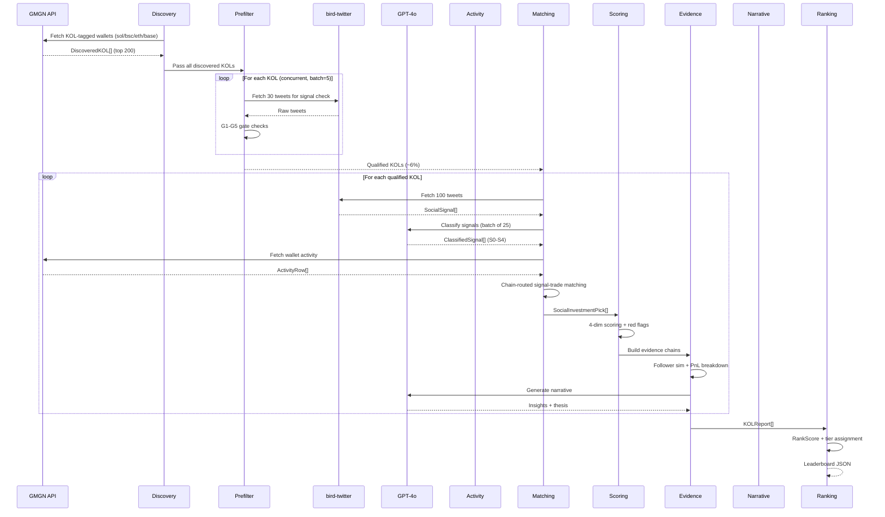
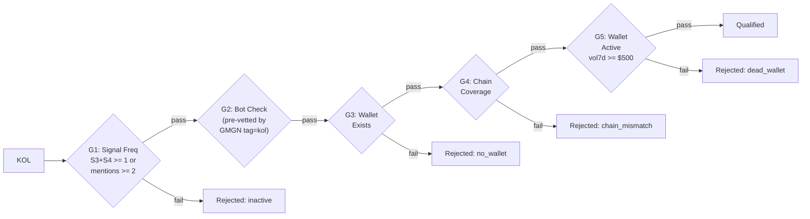
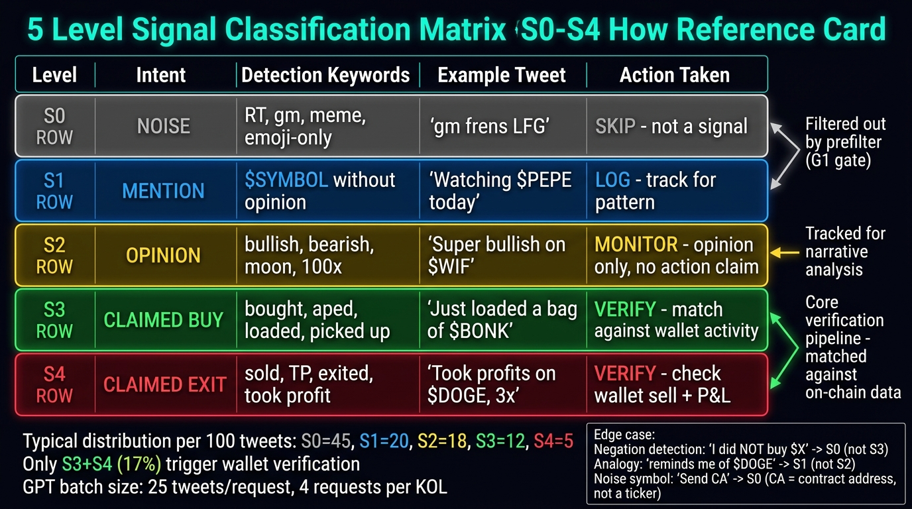
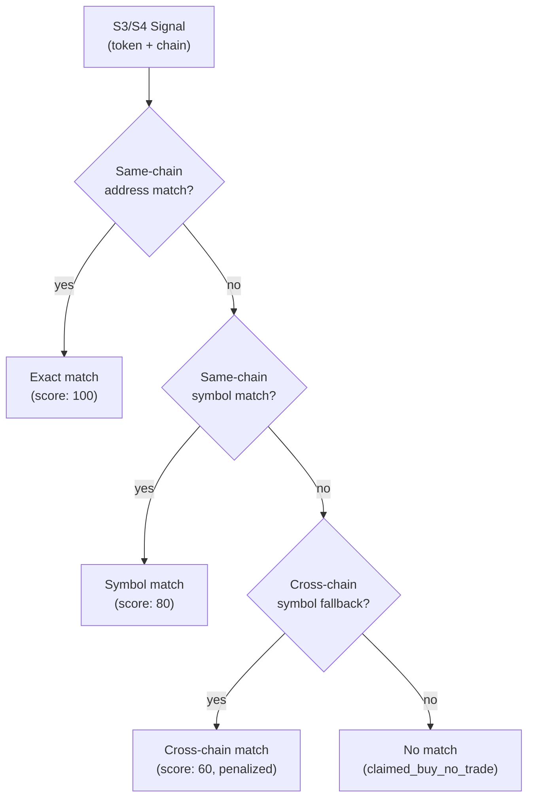
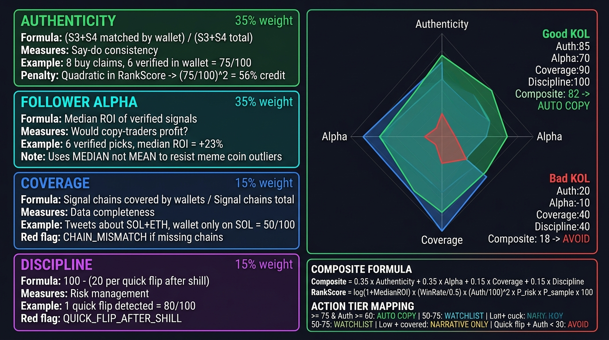
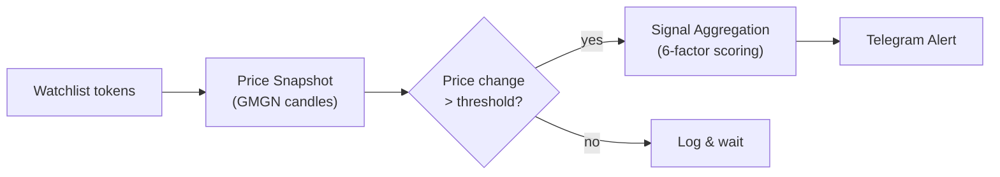

# Pipeline Deep Dive

MemeRecall processes KOLs through a 12-stage pipeline that transforms raw GMGN wallet data into a verified, ranked leaderboard. Each stage has clear inputs, outputs, and failure modes.

## Full Pipeline Flow



---

## Stage 1: Discovery

**Agent:** `kol-discovery-agent.ts`

**Input:** Chain identifiers (`sol`, `bsc`, `eth`, `base`)

**Process:**
- Queries GMGN KOL ranking API: `/rank/{chain}/wallets/7d?tag=kol`
- The `tag=kol` filter returns only wallets with 100% Twitter binding rate
- Fetches top 200 wallets per chain via `bb-browser`
- Deduplicates across chains by Twitter handle

**Output:** `DiscoveredKOL[]` with:
- Twitter handle, display name, follower count
- Wallet addresses per chain
- 7-day realized profit, buy/sell counts

**External Dependencies:** GMGN ranking API (via bb-browser)

**Failure Mode:** No fallback -- pipeline stops if GMGN is unreachable. Falls back to `gmgn-cli track kol` if API fails.

---

## Stage 2: Prefilter (Twitter-First)

**Agent:** `kol-prefilter-agent.ts`

**Input:** `AgentSubject[]` (handle + wallets)

**Process:** Five sequential gates, zero LLM cost:



- G1 uses regex-based signal detection on 30 recent tweets (looks for buy/sell keywords, token mentions)
- G4 checks that the chains mentioned in tweets overlap with the chains of mapped wallets
- Runs concurrently with configurable batch size (default 5)

**Output:** `PrefilterResult[]` with pass/fail + failure reason per KOL

**Key Insight:** This stage saves ~94% of GPT budget. Most GMGN KOL wallets are "Silent Whales" who trade profitably but never tweet signals.

---

## Stage 3: Tweet Collection

**Agent:** `gmgn-social-agent.ts`

**Input:** Twitter handle, lookback count (30-100 tweets)

**Process:**
- Calls `bird-twitter user {handle} --limit N` via bb-browser
- Extracts token references using regex:
  - Contract addresses (0x... for EVM, base58 for Solana)
  - $SYMBOL cashtag mentions
- Infers chain from address format and context keywords

**Output:** `SocialSignal[]` with tweet ID, text, timestamp, URL, extracted tokens

**External Dependencies:** bird-twitter CLI

**Failure Mode:** Returns empty array. Pipeline continues with zero signals (KOL gets low scores).

---



## Stage 4: GPT Signal Classification

**Agent:** `signal-classifier-agent.ts`

**Input:** `SocialSignal[]` (batched in groups of ~25 tweets)

**Process:**
- Sends tweet batch to GPT-4o with structured classification prompt
- GPT returns per-tweet analysis:

| Intent Level | Meaning | Examples |
|-------------|---------|---------|
| **S0** | Noise | Retweets, memes, engagement farming |
| **S1** | Mention | Token name only, no opinion |
| **S2** | Opinion | "Bullish on $X" but no action claim |
| **S3** | Claimed Buy | "Bought $X", "aped in", "loading" |
| **S4** | Claimed Exit | "Sold $X", "took profit", "exited" |

- Detects nuances: negation ("I didn't buy"), analogy references, noise symbols
- Classifies narrative category: `meme_shill`, `tech_analysis`, `celebrity_fomo`, `undisclosed_affiliate`

**Output:** `ClassifiedSignal[]` with intent level, tokens (refined), position claim, reasoning

**External Dependencies:** OpenAI-compatible LLM endpoint

**Cost:** ~$0.01-0.05 per KOL (100 tweets / 25 batch size = 4 LLM calls)

---

## Stage 5: Wallet Activity Collection

**Agent:** `gmgn-activity-agent.ts`

**Input:** Multi-wallet subject (array of `{address, chain}`)

**Process:**
- Queries GMGN OpenAPI `/wallet_activity` for each wallet
- Uses timestamp-based authentication
- Collects buy/sell events with token details, amounts, prices

**Output:** `ActivityRow[]` with tx_hash, event_type, token symbol/address, costUsd, priceUsd, timestamp

**External Dependencies:** GMGN OpenAPI (requires `GMGN_API_KEY`)

**Failure Mode:** Returns empty array (non-fatal). Downstream scoring proceeds without wallet verification -- appropriate red flags are added.

---

## Stage 6: Wallet Analysis

**Agent:** `kol-analysis-agent.ts`

**Input:** Multi-wallet binding

**Process:**
- Fetches wallet profile and current holdings from GMGN
- Computes realized + unrealized PnL per token
- Infers trading style: micro-scalp vs long-holder
- Assesses risk posture

**Output:** `MultiWalletReport` with per-wallet trade decisions, style inference, risk assessment

---

## Stage 7: Chain-Routed Matching

**Agent:** `kol-full-agent.ts` (matching section)

**Input:** `ClassifiedSignal[]` + `ActivityRow[]`

**Process:**



- Groups wallet activities by token (address first, then symbol)
- For each S1+ signal with tokens, finds matching wallet activity
- Determines wallet action: `bought`, `sold`, `round_trip`, `no_wallet_trade`
- Infers timing relationship:
  - `buy_before_signal` -- already held before tweet
  - `immediate_buy` -- bought within 5 min of tweet
  - `quick_buy` -- bought within 1 hour
  - `delayed_buy` -- bought > 1 hour later
  - `late_entry` -- bought > 6 hours later

**Output:** `SocialInvestmentPick[]` with match type, wallet action, confidence score

---



## Stage 8: Four-Dimensional Scoring

**Agent:** `kol-full-agent.ts` (scoring section)

| Dimension | Formula | Weight |
|-----------|---------|--------|
| **Authenticity** | (S3+S4 matched) / (S3+S4 total) | 35% |
| **Follower Alpha** | Median ROI of verified picks | 35% |
| **Coverage** | Signal chains covered by wallets | 15% |
| **Discipline** | 100 - (20 per quick flip after shill) | 15% |

**Composite Score:**
```
composite = 0.35 * authenticity + 0.35 * followerAlpha + 0.15 * coverage + 0.15 * discipline
```

When follower alpha is unavailable (< 3 verified signals), its weight redistributes to authenticity.

---

## Stage 9: Red Flag Detection

**Agent:** `kol-full-agent.ts` (red flags section)

| Flag | Severity | Trigger |
|------|----------|---------|
| `CHAIN_MISMATCH` | High | Signal chains not covered by any mapped wallet |
| `CLAIMED_BUY_NO_TRADE` | High | Claimed to buy but no wallet trade found |
| `QUICK_FLIP_AFTER_SHILL` | High | Sold shortly after promoting a token |
| `CELEBRITY_FOMO_TRIGGER` | Medium | >= 2 tweets leveraging celebrity names |
| `UNDISCLOSED_AFFILIATE` | Medium | Suspected paid promotion detected |
| `SELF_CONTRADICTION` | Medium | Explicitly denied buying tokens they promoted |
| `MICRO_WALLET` | Low | Total wallet trading volume below $1,000 |

---

## Stage 10: Evidence Building

**Agent:** `evidence-builder.ts`

**Input:** Classified signals + activity rows + matched picks

**Process:**
- Creates `EvidenceRow` records linking tweet → on-chain trade → PnL outcome
- Each evidence row contains:
  - Social signal (tweet text, timestamp, URL)
  - On-chain match (tx hash, delta minutes, amount, entry price)
  - Outcome (ROI%, current price, holding status)
  - Verdict: `verified`, `contradicted`, or `unverified`

**Output:**
- `EvidenceRow[]` -- audit trail for every S3/S4 signal
- `FollowerSimResult` -- "If you bought $100 per signal, your ROI would be X%"
- `PnlBreakdownSummary` -- What % of wallet PnL comes from tweeted tokens vs silent trades

---

## Stage 11: Narrative Generation

**Agent:** `narrative-agent.ts`

**Input:** Structured scores, red flags, signal stats, chain coverage

**Process:**
- Sends structured data to GPT with English output prompt
- Generates 3 top insights (1-2 sentences each) and investment thesis (3-5 sentences)
- Fallback: rule-based template if LLM fails

**Output:** `NarrativeOutput` with `insights[3]` + `thesis`

---

## Stage 12: Ranking & Leaderboard

**Agent:** `kol-ranking-agent.ts`

**Input:** `KOLReport[]` (all analyzed KOLs)

**RankScore Formula:**
```
RankScore = log(1 + MedianROI) x (WinRate / 0.5) x (Auth / 100)^2 x P_risk x P_sample x 100
```

| Factor | Purpose |
|--------|---------|
| `log(1 + MedianROI)` | Prevents extreme values from dominating |
| `WinRate / 0.5` | 50% WR = 1.0x, 70% = 1.4x multiplier |
| `(Auth/100)^2` | Quadratic penalty for low authenticity |
| `P_risk` | Red flag penalty (1.0 = none, 0.1 = quick flip) |
| `P_sample` | min(1, verified_signals / 10) -- need >= 10 for full score |

**Fallback:** KOLs with zero verified signals get `composite * P_risk * 0.3` (heavy discount).

**Action Tiers:**

| Tier | Condition | Meaning |
|------|-----------|---------|
| `auto_copy` | Composite >= 75 & Auth >= 60 | Safe to auto-copy trade |
| `watchlist` | Composite 50-75 | Manual confirmation recommended |
| `narrative_only` | Low composite, adequate coverage | Read for narratives only |
| `avoid` | Quick flip + Auth < 30 | Suspected pump-dump |
| `insufficient_data` | Chain mismatch or low coverage | Need more wallet data |

**Output:** `Leaderboard` JSON sorted by composite score, with S/A/B tier assignments.

---

## Watchroom (Separate Pipeline)

The watchroom is an independent real-time monitoring system for specific tokens:

**Agent:** `token-watch-agent.ts` + `watch-signal-aggregator.ts`



**Signal Factors:**
1. Price momentum (5m/30m/5h/24h change)
2. Liquidity quality
3. Holder distribution
4. Flow quality (buy/sell pressure)
5. KOL alignment (known KOL mentions)
6. Freshness (time since launch)

**Chart Data Fallback Chain:** Page candles -> 5m/15m/1h klines -> local snapshots -> empty
